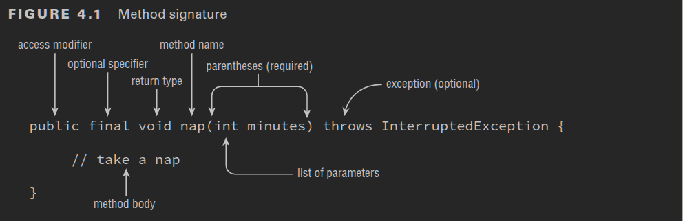

= Methods And Encapsulation
:toc:
:source-highlighter: rouge

[%hardbreaks]
== Designing Methods
.Method signature

== Applying Access Modifiers
==== Private Access
==== Default (Package Private Access) Access
==== Protect Access
==== Designing Static Methods and Fields
==== Calling a Static Variable or Method
==== Static vs. Instance 
==== Static Variables 
==== Static Initialization
==== Static Imports

